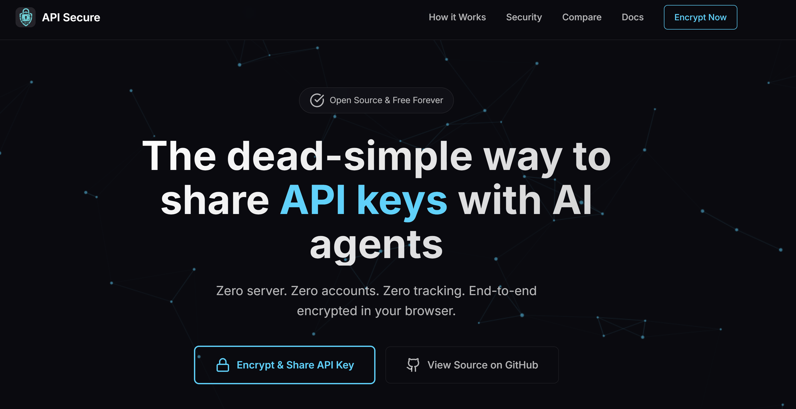
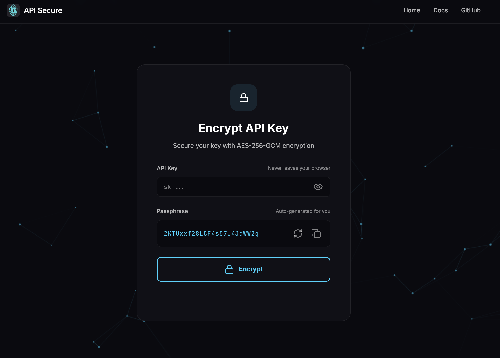
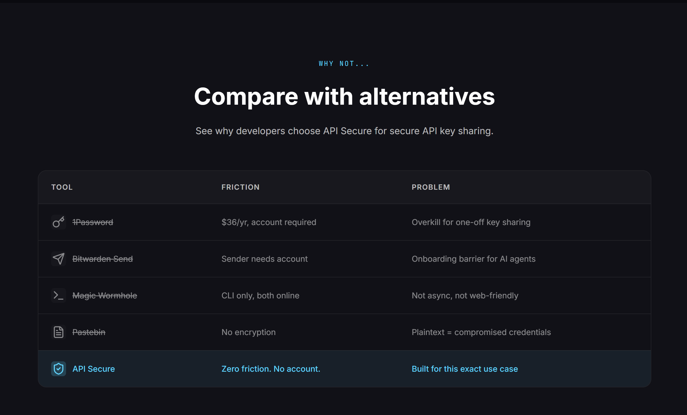
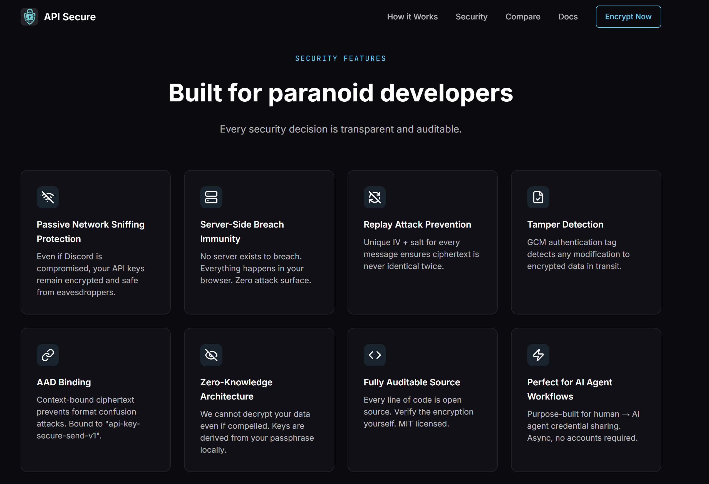
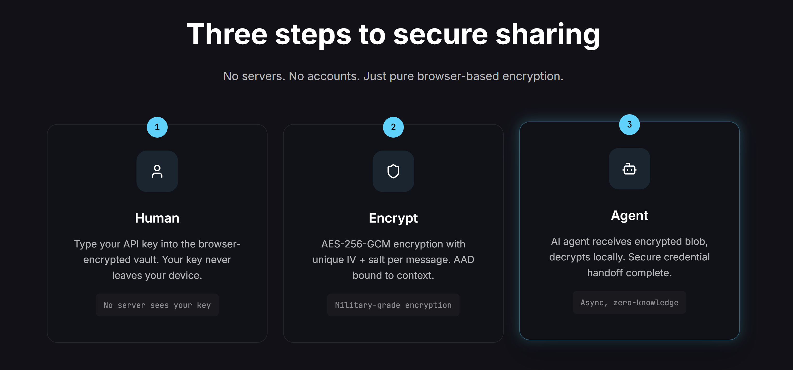

# 🔐 APISecure

**Zero-server API key sharing for AI agents**

## 🎯 The Problem

Sharing API keys is broken:
- ❌ Email/Slack = plaintext exposure
- ❌ 1Password sharing = overkill for single keys
- ❌ Self-hosted solutions = maintenance nightmare

## ✅ The Solution

**APISecure** — Browser-only encryption. No servers. No storage. Just secure.

- 🔐 **AES-256-GCM encryption** — Military-grade, in your browser
- 🚫 **Zero-server architecture** — Keys never touch our servers
- 🌐 **Share via URL** — Encrypted payload in the link itself
- 📱 **Works everywhere** — Any device with a browser
- 🔓 **Browser-based decryption** — No Node.js or CLI tools required
- 📈 **Optimized for large keys** — Handles large API keys without overflow
- 🎨 **Modern UI** — Clean, responsive design with dark mode

## 🚀 How It Works

### Encrypting a Key
1. **Visit [apisecure.app/encrypt.html](https://apisecure.app/encrypt.html)**
2. **Paste your API key** → Browser encrypts it locally
3. **Set a passphrase** → AES-256-GCM protection
4. **Share the URL** → Encrypted payload in the link itself
5. **Key self-destructs** → Optional expiration

### Decrypting a Key
1. **Visit [apisecure.app/decrypt.html](https://apisecure.app/decrypt.html)** or use the link you received
2. **Enter the passphrase** → Decrypt locally in your browser
3. **Copy the key** → Use it in your application
4. **No Node.js required** → Works directly in any modern browser

**Zero servers. Zero storage. Zero trust required.**

## 📸 Screenshots

**Hero Section**

**Encrypt API Key**

**Compare with Alternatives**

**Security Features**

**How It Works (3 Steps)**

## 🛡️ Security Features

| Feature | Implementation |
|---------|---------------|
| Encryption | AES-256-GCM |
| Key Derivation | PBKDF2 (100k rounds) |
| Storage | None (browser-only) |
| Transport | HTTPS/TLS 1.3 |
| Expiration | Configurable TTL |
| Format Version | V2 (optimized for large keys) |

## 🌐 Browser Compatibility

APISecure works on all modern browsers with Web Crypto API support:

- ✅ **Chrome/Edge** 60+ (2017+)
- ✅ **Firefox** 57+ (2017+)
- ✅ **Safari** 11+ (2017+)
- ✅ **Mobile browsers** (iOS Safari, Chrome Android)

**No plugins. No extensions. No Node.js required.**

## 🚀 Quick Start

### Web Interface
- 🔐 **[Encrypt](https://apisecure.app/encrypt.html)** — Encrypt an API key
- 🔓 **[Decrypt](https://apisecure.app/decrypt.html)** — Decrypt a received key
- 📚 **[Documentation](https://apisecure.app/docs.html)** — Full guide
- 📝 **[Blog](https://apisecure.app/blog/)** — Security articles & tutorials

### For AI Agents
Perfect for sharing API keys with:
- Claude Code / OpenClaw agents
- GitHub Copilot extensions
- Local AI tools
- CI/CD pipelines

**Example:** Share an OpenAI key with an AI agent without exposing it in plaintext.

## 💡 Use Cases

- **Share OpenAI keys** with teammates securely
- **Send AWS credentials** without Slack exposure
- **Distribute API tokens** to contractors
- **Rotate leaked keys** with encrypted links

## 🔗 Links

- 🌐 **Live Demo:** [apisecure.app](https://apisecure.app)
- 🐦 **Twitter:** [@charlescsturt](https://twitter.com/charlescsturt)
- 📧 **Contact:** charles@skillshield.dev

## 📜 License

MIT License — Open source and free to use.

---

**Because API keys deserve better than Slack.** 🔐

